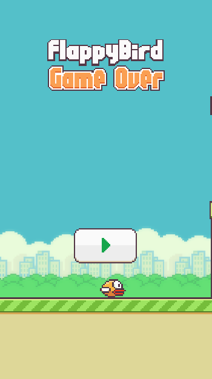

# BirdiVolaide
BirdiVolaide es un juego que he realizado para el módulo de Programación Multimedia y Dispositivos Móviles del ciclo superior de Desarrollo de Aplicaciones Multiplataforma. El juego consiste en un pájaro que debe esquivar los obstáculos que aparecen en el camino. Se juega haciendo click con el ratón para hacer que el pájaro vuele más o menos, cuanto más click hagas más alto volará, sí reduces el número de clicks más bajo volará.

## Enlace de Descarga
[Descargar](https://iesluisvives-my.sharepoint.com/personal/daniel_rodriguezfernandez_alumno_iesluisvives_org/_layouts/15/onedrive.aspx?id=%2Fpersonal%2Fdaniel%5Frodriguezfernandez%5Falumno%5Fiesluisvives%5Forg%2FDocuments%2FMy%20project%2Erar&parent=%2Fpersonal%2Fdaniel%5Frodriguezfernandez%5Falumno%5Fiesluisvives%5Forg%2FDocuments&ga=1)

## Imágenes del juego

## Ejecuta el juego
Para ejecutar el juego debes ejecutar el .exe que se encuentra en la carpeta.

## Para cerrar el juego
Debes ejecutar la combinación de teclas `Alt + F4` para cerrar el juego.